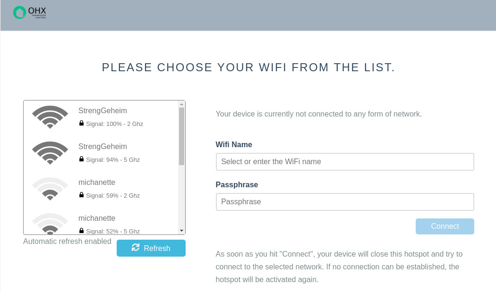

# Wifi-Captive

> Wifi-Captive is a service for dynamically setting the WiFi configuration on a Linux device via a captive portal.
  A web-page allows to enter a WiFi SSID or select a network from a list.

[](https://github.com/openhab-nodes/wifi-captive-rs/actions)
[](https://crates.io/crates/wifi-captive)
[](http://opensource.org/licenses/MIT)

**Release note: This crate contains a local copy of the dbus crate.
As soon as upstream has released 0.8, a new release without that copy is going out.**

This service includes a basic DHCP server for assigning IP addresses to connecting clients
and a DNS server for redirecting all pages to the captive portal.



This software is written in [Rust](https://rustup.rs/) (native compiled binary) and supports the most common network management services:

* *NetworkManager* (Desktop Linux OS),
* *iwd* (New wifi management service),
* and *connman* (Embedded Linux).

> ❯ Antique interfaces like ifup/down and wpa_supplicant as well as the kernel API directly are not targeted.

## Table of Contents

1. [Usage](#usage)
1. [How it works](#how-it-works)
1. [Development, Get Involved](#development,-get-involved)
1. [System ports](#system-ports)
1. [Acknowledgements](#acknowledgements)
    1. [Similar projects](#similar-projects)
1. [FAQ](#faq)

## Usage

**Download** a binary for your architecture from the Github Releases page or
as software container from the Github Docker Registry. 

For building instructions, software container deployment and cross-compiling read:
[Advanced Deployments](doc/deployment.md).

**Start** by first assigning your destination link a static IP (the gateway IP),
 that must not collide with any later DHCP assigned IP. For an interface *wlp58s0* you might use:
 `sudo ip address change 192.168.4.1/24 brd 192.168.4.255 dev wlp58s0`

Logging is controlled by the `RUST_LOG` env variable.
It can be set to DEBUG, INFO, WARN, ERROR. Default is ERROR.
  
Use `RUST_LOG=info ./wifi-captive -l 3000 -g 127.0.0.1 --dns-port 1535 --dhcp-port 6767` to start the service
without additional privileges. The command line parameters are decribed below and also if you execute `./wifi-captive -h`.
- The hotspot gateway for this example is 127.0.0.1 and the http portal will be on http://127.0.0.1:3000,
- the dns server is on 1535,
- the dhcp server on 6767.

The wifi hotspot will be called "Wifi Connect" and the passphrase is "wificonnect".

Refer to [System ports](#system-ports) if you want to run `./wifi-captive` if you want to run in production mode.

## How it works

WiFi Connect interacts via DBUS with *NetworkManager* or *iwd* or *connman*.

### 1. No connectivity / Connection lost

**Only if** no connectivity is reported
**and** no WiFi connection can be established for more than 20 seconds although one is configured:

The application detects available WiFi networks and
opens an access point with a captive portal.

The access point ssid is, by default, `WiFi Connect` with no password.

### 2. Captive Portal

After connecting to the access point, all modern devices and operating systems
will detect the captive portal and open its web page.

Opening any non encrypted web page will redirect to the captive portal as well.

### 3. Enter WiFi Network Credentials

The captive portal provides the option to select a WiFi from a list
or enter a SSID directly.
If necessary a passphrase must be entered for the desired network.
WEP, WPA2 and WPA2 Enterprise are supported.

### 4. Service Connects to WiFi Network

When the network credentials have been entered,
the service will disable the access point and try to connect to the network.

If the connection fails, it will enable the access point for another attempt.
If it succeeds, the configuration will be saved by the used network backend,
either network-manager or iwd.

## System ports

The default ports for this service to operate are:

* port 80 for the webserver,
* port 67/68 for the DHCP server and
* port 53 for the dns server.

Those ports are considered "system" ports and require elevated permissions.
You need to either run the application as root or set the NET_BINDSERVICE capability like so:
`sudo setcap CAP_NET_BIND_SERVICE=+eip /path/to/binary`.

### Command line options

If both a command line option and an environment variable counterpart (identified by a leading $) is defined,
the command line option will take higher precedence.

*   **--help**

    Print available command line parameters
    
*   **-g, --portal-gateway** gateway, **$PORTAL_GATEWAY**

    Gateway of the captive portal WiFi network

    Default: _192.168.42.1_

*   **-l, --portal-listening-port** listening_port, **$PORTAL_LISTENING_PORT**

    Listening port of the captive portal web server

    Default: _80_

*   **-i, --portal-interface** interface, **$PORTAL_INTERFACE**

    Wireless network interface to be used by WiFi Connect.
    If not set, the first wireless interface returned by the network backend is used.

*   **-p, --portal-passphrase** passphrase, **$PORTAL_PASSPHRASE**

    WPA2 Passphrase of the captive portal WiFi network

    Default: "wificonnect"
    
*   **-f, --passphrase_file** passphrase file, **PORTAL_PASSPHRASE_FILE**

    The portal SSID and WPA2 Passphrase, given via file.
    The file should contain at least one line with the passphrase in plain text, utf8 encoded.
    If the file contains two lines, the second line is used for the portal ssid.

*   **-s, --portal-ssid** ssid, **$PORTAL_SSID**

    ssid of the captive portal WiFi network

    Default: _WiFi Connect_
    
*   **-w, --wait-before-reconfigure** sec, **$PORTAL_WAIT**

    Time in seconds before the portal is opened for re-configuration,
    if no connection can be established.

    Default: _20_

*   **-r, --retry-in** sec, **$PORTAL_RETRY_IN**

    Time in seconds before retrying to connect to a configured WiFi SSID.
    The attempt happens independently if a portal is currently open or not,
    but if a portal and access point is set up, it will be temporarily shut down
    for the connection attempt.
    The timer is reset whenever a client connects to the captive portal.

    Default: _360_

*   **-q, --quit-after-connected**

    Exit after a connection has been established. 

    Default: _false_

*   **--internet-connectivity**

    Require internet connectivity to deem a connection successful.
    Usually it is sufficient if a connection to the local network can be established.

    Default: _false_
    
*   **-u, --ui_directory dir**, **$UI_DIRECTORY**

    The directory where the html files reside.

    Default: _not set_

## Acknowledgements

* DHCP: Inspired by https://github.com/krolaw/dhcp4r (Richard Warburton).
  The implemented version in this crate is rewritten with only the packet struct being similar. 
* DNS: Inspired by https://github.com/EmilHernvall/dnsguide/blob/master/samples/sample4.rs (Emil Hernvall). 
  The implemented version in this crate is rewritten. The Query, Record, Header and Packet
  data structures are similar. 
* Dbus-rs: A great crate for interfacing DBus. 


## Development, Get Involved

PRs are welcome. A PR is expected to be under the same license as the crate itself.
This crate is using rusts async / await support (since Rust 1.39) via the Tokio executor.

The UI is html, css based on pure-css and vanilla javascript ES9.

There is not yet a full integration test.
IMO a good one would fake network manager responses which requires a dbus service.
The dbus crate is currently (as of Dec 2019) restructuring how dbus services are written.  

Because system ports are tedious to work with during development,
you can use the helper program *set_net_cap* in `scripts`.
Use it like this: `./scripts/set_net_cap target/debug/wifi-captive`. Just add it as a last build step to your development environment.

It makes use of the fact that a setuid program doesn't require you to enter a password.
To compile the C program, change the ownership to the root user and set the setuid bit,
do this:

```shell
gcc -o scripts/set_net_cap scripts/set_net_cap.c && \
sudo chown root:root scripts/set_net_cap && \
sudo chmod +s scripts/set_net_cap
``` 

### Similar projects

There is also *Wifi-Connect*, also written in Rust, from <a href="https://balena.io">balena.io</a>.
* It is based on futures 0.1 and uses Iron as http server framework.
* It is not designed as long running background service. It quits after a connection
has been established.
* User must be root (UID=0). Uses an external tool (`dnsmasq`) for DNS and DHCP-IP provisioning.
* It only supports *NetworkManger*. 

A related set of utilities is [wifish](https://github.com/bougyman/wifish), a script with a TUI that
talks directly to wpa_supplicant. The user selects a wifi and the connection is established.
And second [create_ap](https://github.com/oblique/create_ap), a script which uses *dnsmasq*, *hostapd*
and *iw* under the hood to create an access point. 

## FAQ 

* **Can I configure multiple access points for fallback reasons?**
  Not per se. But you could configure once access point, disable that one
  (or move out of its range) and configure a second / third one.
  This service will try all known connections when in *reconnect* mode.
  
* **Are 2.4Ghz / 5 Ghz access points with the same SSID used interchangeably?**
  - For the network manager backend: No! The user interface always shows the frequency of the selected access point
    and exactly that one is stored and used.
  - For the iwd backend: Yes. For *iwd* the frequency doesn't matter.

* **Does scanning work during hotspot mode?**
  Many network chipsets do not support that. If a second / other wireless chipsets
  are installed, those will be used instead for scanning.

* **How do I customize the UI?**
  The distributed docker containers and binaries cannot be customized. The UI is embedded into the app.
  - Disable the "embed UI" feature during compilation and use the "--ui_directory" command line argument later on.
  - Alternatively build with `UI_DIRECTORY=dir cargo build --release` where `dir` must be the path to your ui files. 

-----
 David Gräff, 2019-2020